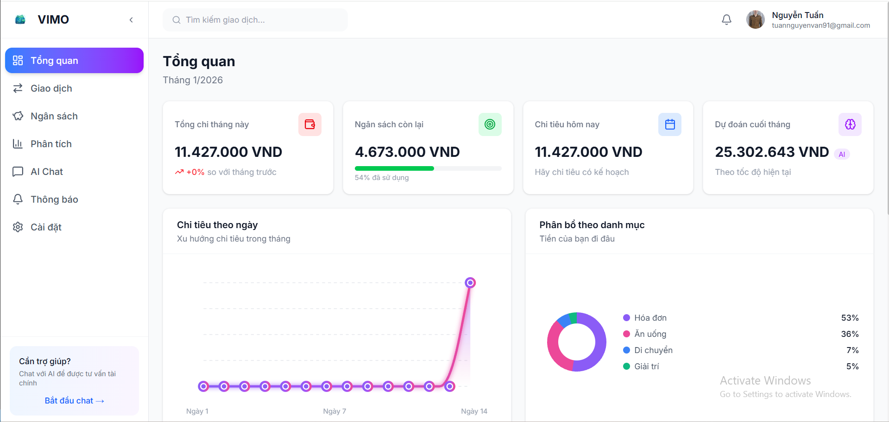
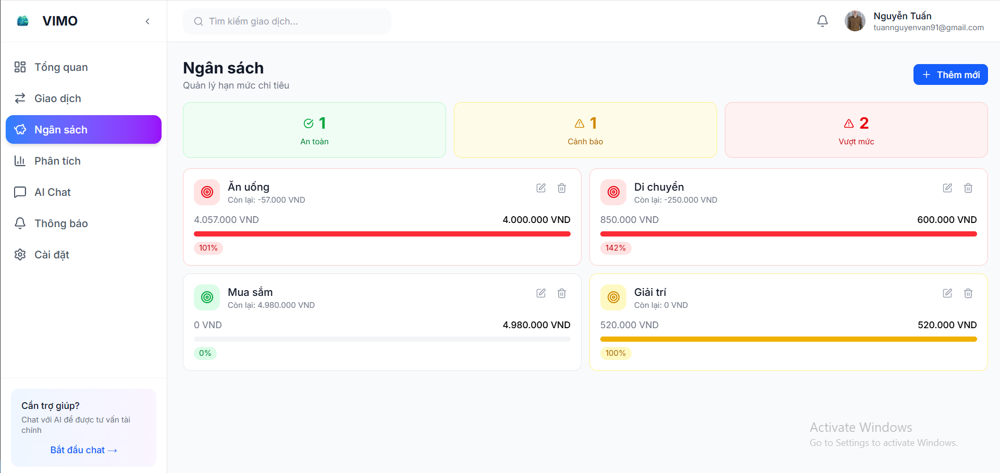

# VIMO - Smart Finance Management

> Ứng dụng quản lý tài chính cá nhân thông minh với AI

## 📸 Screenshots

| Trang chủ | Dashboard | Giao dịch |
|:---------:|:---------:|:---------:|
|  |  |  |

| Ngân sách | Phân tích | AI Chat |
|:---------:|:---------:|:-------:|
|  |  |  |

## ✨ Tính năng

- 🔐 **Xác thực**: Đăng nhập/Đăng ký, Google OAuth, Quên mật khẩu
- 💰 **Quản lý giao dịch**: Thu/Chi, Tìm kiếm, Lọc theo danh mục
- 📊 **Ngân sách**: Thiết lập giới hạn, Cảnh báo vượt ngân sách
- 📈 **Phân tích**: Biểu đồ chi tiêu theo ngày/tháng/năm
- 🤖 **AI Chat**: Tư vấn tài chính thông minh với GPT
- 🔔 **Thông báo**: Real-time với Socket.IO
- 🔍 **Tìm kiếm**: Tìm giao dịch nhanh từ header

## 🛠️ Tech Stack

- **Framework**: Next.js 15 (App Router)
- **Language**: TypeScript
- **Styling**: Tailwind CSS
- **State Management**: TanStack Query (React Query)
- **Real-time**: Socket.IO Client
- **Icons**: Lucide React
- **HTTP Client**: Axios

## 🚀 Cài đặt

### Yêu cầu
- Node.js 18+
- npm hoặc yarn

### Bước 1: Clone repo
```bash
git clone https://github.com/NguyenTu11/SmartSpend-Frontend.git
cd smartspend-frontend
```

### Bước 2: Cài đặt dependencies
```bash
npm install
```

### Bước 3: Tạo file .env
```env
NEXT_PUBLIC_API_URL=http://localhost:8000/api
NEXT_PUBLIC_SOCKET_URL=http://localhost:8000
NEXT_PUBLIC_GOOGLE_CLIENT_ID=your_google_client_id
```

### Bước 4: Chạy development server
```bash
npm run dev
```

Mở [http://localhost:3000](http://localhost:3000) để xem ứng dụng.

## 📁 Cấu trúc thư mục

```
src/
├── app/                    # App Router pages
│   ├── auth/              # Trang xác thực
│   ├── dashboard/         # Trang dashboard
│   └── page.tsx           # Landing page
├── components/            # React components
├── hooks/                 # Custom React hooks
├── services/              # API services
├── types/                 # TypeScript types
└── lib/                   # Utilities
```

## 🔗 Backend

Ứng dụng này cần backend để hoạt động. Xem repo backend tại:
- [SmartSpend-Backend](https://github.com/NguyenTu11/SmartSpend-Backend.git)

## 📝 License

MIT License - Xem file [LICENSE](LICENSE) để biết thêm chi tiết.

---

Made with ❤️ by [NguyenTu11]
